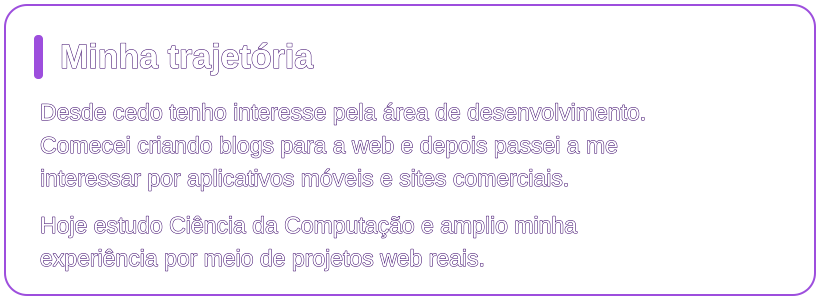
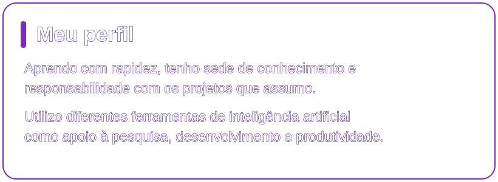
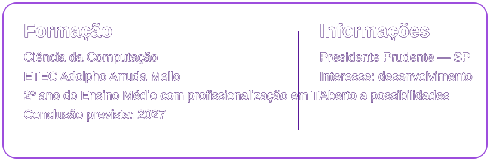
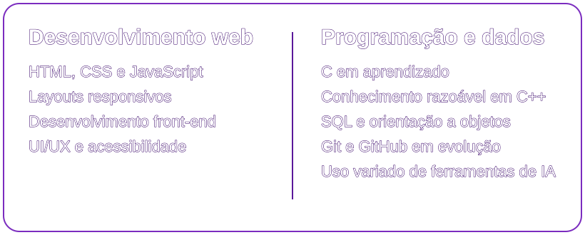
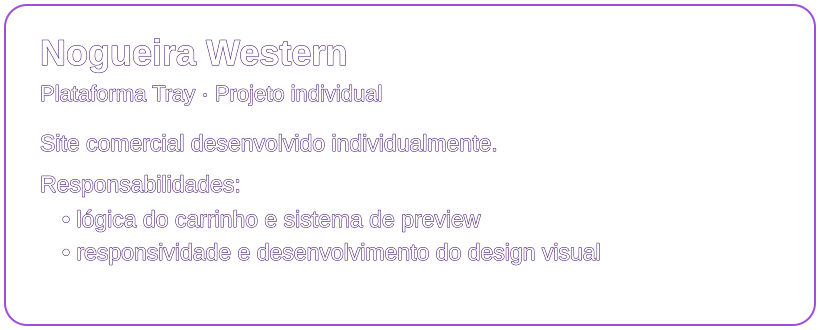
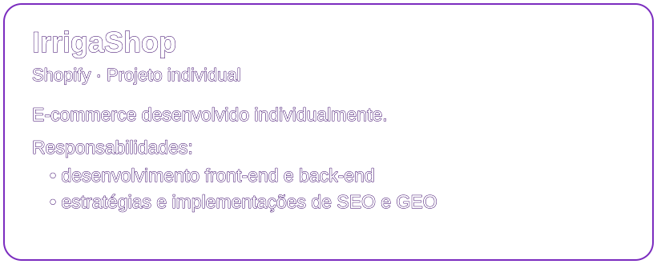

<!-- Adicione em assets/: banner.png, imagem1.png, imagem2.png e gengar.gif -->

# David

  
  
   
  
  

 

## Sobre mim

### Trajetória e perfil

  
  

### Formação e informações

## Conhecimentos e capacidades

### Tecnologias

  
  
  
  
  
  
  
  

 

### Desenvolvimento, programação e dados

## Projetos desenvolvidos

### Projetos comerciais

  
  

  
  

## Estatísticas do GitHub

### Commits e linguagens

  <picture>
    <source media="(prefers-color-scheme: dark)" srcset="https://github-readme-stats.vercel.app/api?username=D4V1D_&show_icons=true&include_all_commits=true&count_private=true&hide_border=true&bg_color=0D0014&title_color=C77DFF&icon_color=9D4EDD&text_color=F2E9FF&locale=pt-br" />
    
  </picture>
  <picture>
    <source media="(prefers-color-scheme: dark)" srcset="https://github-readme-stats.vercel.app/api/top-langs/?username=D4V1D_&layout=pie&langs_count=8&size_weight=0.5&count_weight=0.5&hide_border=true&bg_color=0D0014&title_color=C77DFF&text_color=F2E9FF&locale=pt-br" />
    
  </picture>

## Interesses pessoais

### Fora do código

  
  
  

  <h2>Visitas ao perfil</h2>
  <h3>Contador</h3>
  
    
  
  

